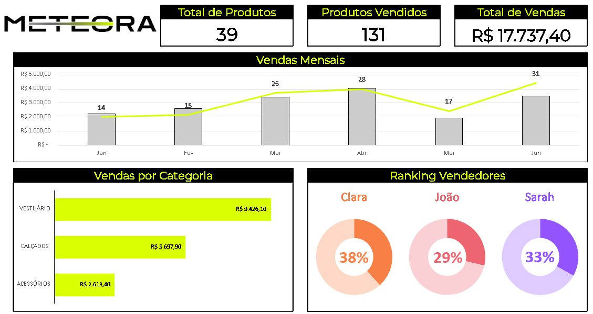

📊 Dashboard de Vendas - Excel

Este projeto consiste na criação de um dashboard interativo no Excel, desenvolvido com o objetivo de transformar dados brutos em informações visuais claras e estratégicas para apoio à tomada de decisão.

🚀 Sobre o Projeto

Durante o desenvolvimento, foram aplicados conceitos fundamentais de análise de dados e visualização, resultando em um painel que apresenta:

- Total de produtos cadastrados
- Quantidade de produtos vendidos
- Faturamento total
- Evolução das vendas mensais
- Desempenho por categoria
- Ranking de vendedores

O dashboard foi construído com foco em clareza, organização visual e facilidade de interpretação.

🛠️ Ferramentas e Recursos Utilizados
- Microsoft Excel
- Formatação Condicional
- Gráficos (coluna, linha e rosca)
- Organização de dados em tabelas

📚 Conceitos Aplicados

Uso de funções como:
  - SOMASE
  - PROCX
  - CONT.VALORES
- Estruturação de dados para análise
- Criação de dashboards interativos
- Boas práticas de visualização de dados

📈 Objetivo

O principal objetivo deste projeto foi desenvolver habilidades práticas na criação de dashboards, melhorando a capacidade de:

Analisar dados
Gerar insights
Construir painéis informativos eficientes

🖼️ Preview

📌 Aprendizados

Este projeto foi essencial para consolidar conhecimentos em Excel e entender, na prática, como dados podem ser transformados em informações valiosas para negócios.

👤 Autor: 
Miguel Aparecido de Moraes 
🔗 LinkedIn: https://www.linkedin.com/in/oieusoumiguel/ 
🔗 GitHub: https://github.com/MoraesMiguel
